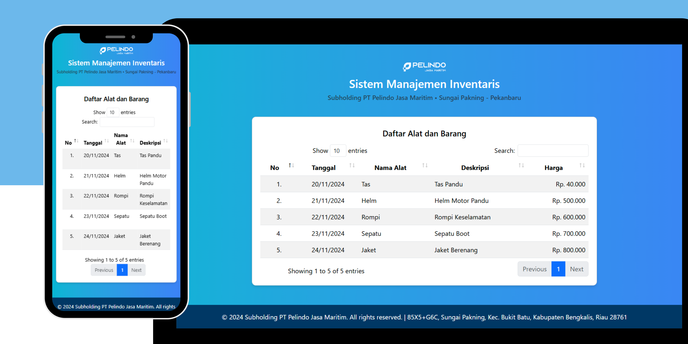

##

### Sistem Manajemen Inventaris | Subholding PT. Pelindo Jasa Maritim • Sungai Pakning - Pekanbaru

## 📙 Description

I worked on this project while carrying out practical work at the PT Pelindo Jasa Maritim Subholding, Sungai Pakning - Pekanbaru. This project aims to develop a tool and goods management web application.

The full use of websites in the office is still relatively new, so we were asked to develop a system that is integrated with a familiar application, namely Excel. In this case, we utilize Google Sheets as the backend of the application. Data from Spreadsheets is sent via an API designed using Apps Script, then displayed on the web.

Using Google Spreadsheets as a backend makes implementation easier because users are familiar and proficient in using Excel or Spreadsheets.

